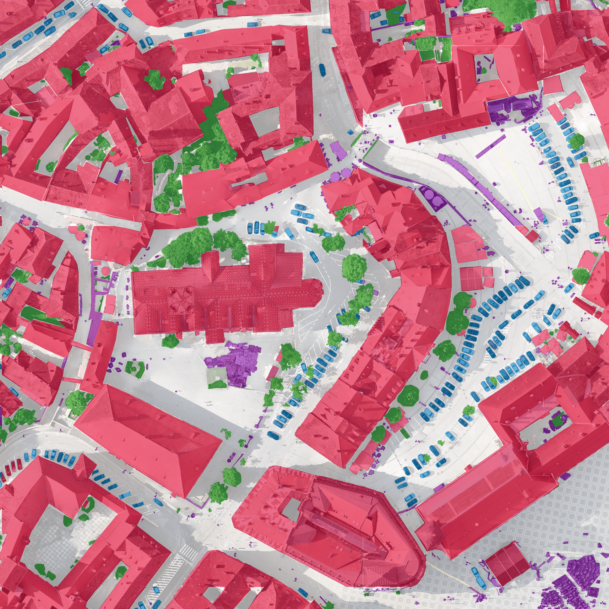
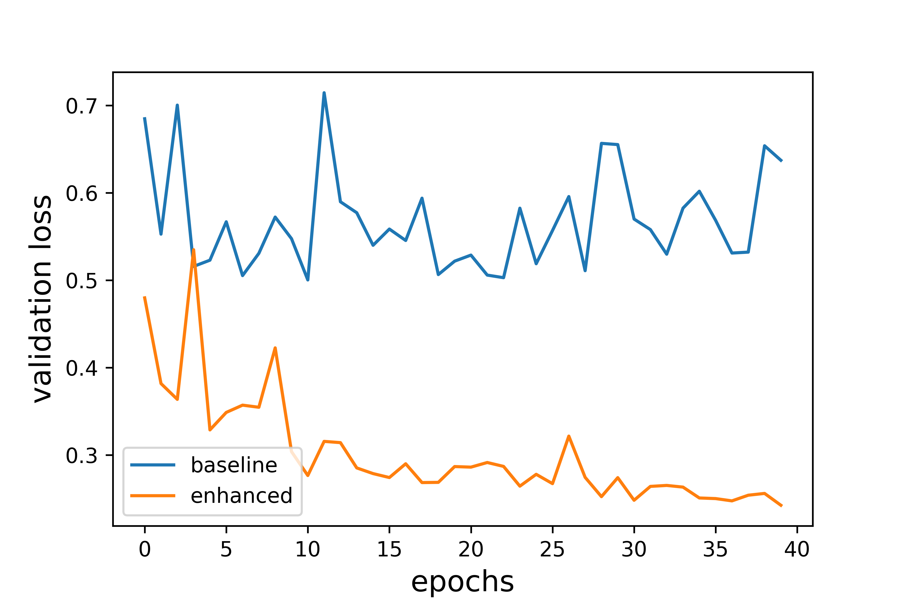
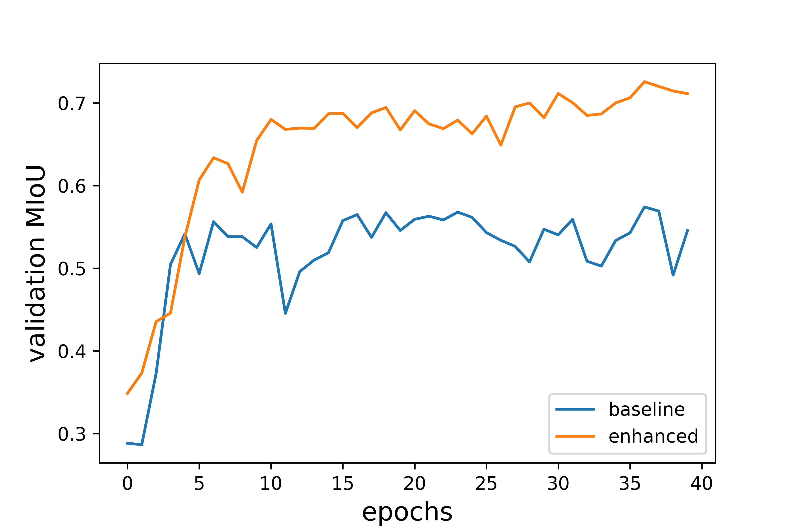
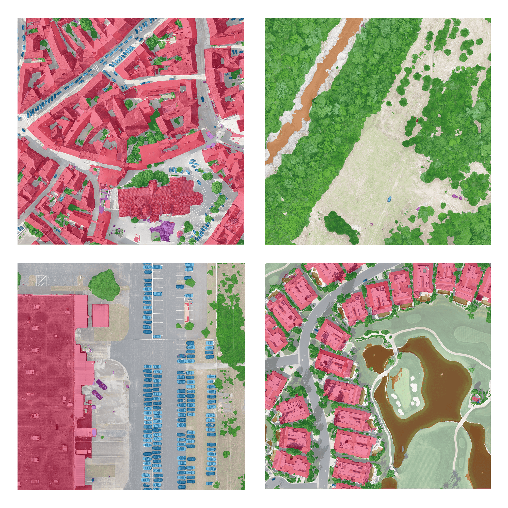

# Orthophoto Segmentation Benchmark Toolkit 🗺

Developed in the context of my bachelor thesis 
this repository provides a toolkit to run semantic segmentation benchmarks on several state of the art neuronal networks for aerial images based on DroneDeploy's Semantic Segmentation Benchmark Dataset.



# Description

This repository implements the foundation for a detailed neural network benchmark in context of real-time applications on a NVIDIA Jetson TX2.

Accuracy-Speed comparsion of different state of the art models for semantic segmentaion:


## DroneDeploy dataset enhancement

Due to underperforming results on my first trainings I investigated the dataset in detail and noticed a significant amount of noise in some regions of the dataset orthophotos which leads to problems with the sampling algorithm used by the DD implementation. To overcome this issue a enhancement algorithm is applied to the dataset. The results are visualized below.


Furthermore a custom dataset split algorithm based on random distribution with a ratio  ⅓ / ⅙ / ⅙ for Train/Validation/Test data was implemented which replaced the image bases approach used in the base repository.

Both optimizations combinded are leading to better predicitons results on the dataset by increasing the mean Intersection over Union score and reducing overfitting:

Loss      | Mean Intersection over Union
:-------------------------:|:-------------------------:
  |  


## Model benchmarks

| Architectures | Encoder                 | Building IoU   | Clutter IoU    | Vegetation IoU | Water IoU      | Ground IoU     | Car IoU        | mIoU         | wmIou          | FPS Onnx 2070S | FPS ONNX TRT TX2 | Power consumption [mW] on TX2 | Potsdam mIoU   | generalisation_loss mIOU | Potsdam wmIoU  | generalisation_loss wmIOU |
|---------------|-------------------------|----------------|----------------|----------------|----------------|----------------|----------------|--------------|----------------|----------------|------------------|-------------------------------|----------------|--------------------------|----------------|---------------------------|
| U-Net         | Resnet18                | 0.8426768531 | 0.5160657077 | 0.7729120897 | 0.7471346146 | 0.8930295179 | 0.6829460567 | 0.7424608066 | 0.8528877976 | 93.54344439  | 16.46894187    | 14736                         | 0.5072224212 | 0.3168360987           | 0.6377983848 | 0.2521895769            |
| U-Net         | Resent50                | 0.8609411685 | 0.5133670905 | 0.7774508051 | 0.6265864658 | 0.8926476261 | 0.7059042377 | 0.729482899  | 0.8521754141 | 56.79252838  | 8.824342829    | 15530                         | 0.4859218253 | 0.333881814            | 0.603065507  | 0.2923223353            |
| U-Net         | ResNext50               | 0.8610069257 | 0.501888998  | 0.7836213891 | 0.7377732303 | 0.8991861802 | 0.7151404832 | 0.7497695344 | 0.860303637  | 24.09909742  | 7.186249607    | 13584                         | 0.5036039428 | 0.328321678            | 0.6237347988 | 0.2749829572            |
| U-Net         | ResNext101              | 0.8748312455 | 0.5296957001 | 0.7852221231 | 0.7761476699 | 0.9010938153 | 0.7294085552 | 0.7660665182 | 0.8649250817 | 15.58157609  | 5.055959031    | 14775                         | 0.4931061333 | 0.3563142082           | 0.624267098  | 0.2782414209            |
| U-Net         | EfficientNetB0          | 0.8732225761 | 0.5217970919 | 0.7769144395 | 0.7764394113 | 0.8997970106 | 0.7126468132 | 0.7601362238 | 0.8621425896 | 80.80520774  | 11.82757851    | 13714                         | 0.516361284  | 0.3206990171           | 0.6479794755 | 0.2484079974            |
| U-Net         | EfficientNetB1          | 0.8874176046 | 0.5388139031 | 0.7860327966 | 0.749055422  | 0.9040877034 | 0.7306512223 | 0.7660097753 | 0.8678154555 | 67.89875753  | 10.19431939    | 13485                         | 0.5370575796 | 0.2988893916           | 0.677510309  | 0.219292184             |
| U-Net         | EfficientNetB2          | 0.8728983235 | 0.5210754095 | 0.7779034918 | 0.785936375  | 0.9057406923 | 0.7402070236 | 0.7672935526 | 0.8666593398 | 68.00810385  | 9.749718335    | 13562                         | 0.5312894017 | 0.30758                | 0.6757313765 | 0.2203033586            |
| U-Net         | MobileNetV3             | 0.8666972969 | 0.4964579692 | 0.7849148912 | 0.7972984906 | 0.9033432194 | 0.7125504342 | 0.7602103836 | 0.8652544933 | 67.1329723   | 15.80229703    | 13752                         | 0.4693001958 | 0.3826706317           | 0.6225505511 | 0.2805000657            |
| U-Net         | MobileNetV3Minimal      | 0.8512944765 | 0.4807947616 | 0.7704762997 | 0.7537633745 | 0.894934768  | 0.6997713066 | 0.7418391645 | 0.8539976146 | 76.15931614  | 18.43512511    | 14247                         | 0.4817282039 | 0.3506298576           | 0.6124485312 | 0.2828451499            |
| U-Net         | MobileNetV3Small        | 0.8400422198 | 0.4814720742 | 0.7605889589 | 0.7447922538 | 0.8851996429 | 0.6168180559 | 0.7214855914 | 0.8439256654 | 101.472261   | 21.23860413    | 13262                         | 0.4671245289 | 0.3525518257           | 0.6091802971 | 0.2781588213            |
| U-Net         | MobileNetV3SmallMinimal | 0.7961384831 | 0.4449807957 | 0.7339173931 | 0.7313017504 | 0.8743262417 | 0.6267970321 | 0.701243616  | 0.8265025264 | 121.5508429  | 23.01128385    | 13377                         | 0.4624027602 | 0.3405961214           | 0.5988305839 | 0.2754643032            |
| U-Net         | Xception                | 0.8729323544 | 0.5102737972 | 0.774448364  | 0.7906586131 | 0.898112272  | 0.687530966  | 0.7556593944 | 0.860492195  | 71.50748504  | 7.851418106    | 15308                         | 0.4534070597 | 0.3999848833           | 0.5998775191 | 0.302866984             |
| PSP           | Resnet18                | 0.8334248459 | 0.459597235  | 0.7621892628 | 0.7393196283 | 0.8856246764 | 0.6041636723 | 0.7140532201 | 0.8431274584 | 132.0969063  | 35.29246612    | 13790                         | 0.4596202956 | 0.3563220743           | 0.5861607989 | 0.3047779514            |
| PSP           | Resent50                | 0.8281815924 | 0.461413372  | 0.7661283089 | 0.7661283089 | 0.8881580776 | 0.6145772976 | 0.7170233698 | 0.8452382462 | 88.93473969  | 17.19594312    | 14698                         | 0.4943202233 | 0.310593986            | 0.6324726417 | 0.2517226421            |
| PSP           | ResNext50               | 0.8614972609 | 0.511404975  | 0.7742723841 | 0.7585164786 | 0.8948678655 | 0.654779926  | 0.7425564817 | 0.8561936799 | 30.52503052  | 11.8254673     | 13905                         | 0.4557689563 | 0.386216446            | 0.5965227218 | 0.3032853012            |
| PSP           | ResNext101              | 0.8677722596 | 0.5096758696 | 0.7707880061 | 0.7762935517 | 0.891482127  | 0.6705253201 | 0.747756189  | 0.8544161278 | 18.39538864  | 6.860211565    | 14470                         | 0.5038915864 | 0.3261284978           | 0.6534102155 | 0.2352552881            |
| PSP           | EfficientNetB0          | 0.8412447023 | 0.4943955958 | 0.7570554455 | 0.7328019119 | 0.8837719582 | 0.6319598017 | 0.7235382359 | 0.8425401599   | 147.9465026  | 22.22346911    | 11781                         | 0.4487522073 | 0.3797809362           | 0.5989480917 | 0.2891162698            |
| PSP           | EfficientNetB1          | 0.8594306105 | 0.4987184773 | 0.7754682357 | 0.7694928157 | 0.8948895735 | 0.6397288912 | 0.739621434  | 0.8561168801 | 119.5614486  | 18.1434338     | 11590                         | 0.466441347  | 0.3693512308           | 0.5996894731 | 0.2995238301            |
| PSP           | EfficientNetB2          | 0.8674798496 | 0.4980968335 | 0.7812630939 | 0.7611189874 | 0.8978671461 | 0.6427443401 | 0.7414283751 | 0.8597093105   | 112.5350547  | 17.06850758    | 11934                         | 0.4829021229 | 0.3486867523           | 0.6236606685 | 0.2745679721            |
| PSP           | EfficientNetB3          | 0.8634164987 | 0.5200513137 | 0.7771978309 | 0.7812797191 | 0.8960845662 | 0.6671303288 | 0.7508600429 | 0.8585767362 | 95.69268104  | 14.41296412    | 12500                         | 0.4985897013 | 0.3359751847           | 0.6236391462 | 0.2736361004            |
| PSP           | EfficientNetB4          | 0.8582311106 | 0.5378491737 | 0.7804202751 | 0.7878292551 | 0.8971655711 | 0.6732819461 | 0.755796222  | 0.8600001874 | 76.33051725  | 10.97859816    | 12239                         | 0.5326656358 | 0.2952258554           | 0.6737934561 | 0.2165194078            |
| PSP           | MobileNetV3             | 0.8551784253 | 0.507927557  | 0.7658417941 | 0.7804129143 | 0.8941968742 | 0.6417049256 | 0.7408770818 | 0.8540356208 | 101.7997172  | 36.35074784    | 11590                         | 0.443346849  | 0.4015918971           | 0.5818182315 | 0.3187424302            |
| PSP           | MobileNetV3Small        | 0.8130931419 | 0.447184653  | 0.7518107707 | 0.743225998  | 0.8805616754 | 0.5831842158 | 0.7031767425 | 0.8356089746 | 171.1651727  | 51.91638754    | 10832                         | 0.375132024  | 0.4665181577           | 0.505868024  | 0.3946115476            |
| PSP           | MobileNetV3Minimal      | 0.8402858568 | 0.4675785126 | 0.7539419822 | 0.7537249868 | 0.8845758046 | 0.6094049019 | 0.7182520075 | 0.8422041269 | 110.6132287  | 45.23917409    | 11590                         | 0.3524595768 | 0.5092814595           | 0.4822938935 | 0.4273432317            |
| PSP           | MobileNetV3SmallMinimal | 0.7809442412 | 0.4428144882 | 0.7213910007 | 0.6991088337 | 0.8652778696 | 0.5682845038 | 0.6796368229 | 0.8155198275 | 190.0190589  | 57.1489182     | 10832                         | 0.3492792438 | 0.4860795765           | 0.4895383087 | 0.3997223707            |
| PSP           | Xception                | 0.58852023   | 0.31353699   | 0.70324388   | 0.66230794   | 0.84047246   | 0.38437459   | 0.5820760145 | 0.7720436942 | 206.3642743  | 29.30300299    | 13409                         | 0.2584311528 | 0.5560182067           | 0.3779244489 | 0.5104882641            |
| FPN           | Resnet18                | 0.8436738364 | 0.5046297506 | 0.7764298414 | 0.7655660523 | 0.8936019142 | 0.6899882695 | 0.7456482774 | 0.8542397153 | 52.74228222  | 4.724207994    | 15308                         | 0.4601303691 | 0.3829123153           | 0.5989931518 | 0.2987996917            |
| FPN           | Resnet50                | 0.8537268664 | 0.4524734263 | 0.7867324097 | 0.7566108896 | 0.9002350283 | 0.7352684077 | 0.747507838  | 0.8602958127 | 42.77602729  | 4.52249638     | 16177                         | 0.5056740341 | 0.3235200912           | 0.6267611418 | 0.2714585697            |
| FPN           | ResNext50               | 0.8679170154 | 0.477857741  | 0.7815318767 | 0.7599823154 | 0.9010141682 | 0.7140018413 | 0.7503841597 | 0.861819049  | 21.15936387  | 4.022354612    | 15606                         | 0.5075049014 | 0.3236732214           | 0.6303910554 | 0.2685343215            |
| FPN           | EfficientNetB0          | 0.859159611  | 0.5286120117 | 0.7758487192 | 0.7500167647 | 0.895909015  | 0.7260358977 | 0.7559303365 | 0.8575520077 | 50.93828318  | 5.009724958    | 15872                         | 0.4997940241 | 0.3388358689           | 0.6318454217 | 0.2631987144            |
| FPN           | EfficientNetB1          | 0.8783066145 | 0.5383846356 | 0.7813277459 | 0.7668568636 | 0.902117568  | 0.7409839406 | 0.767996228  | 0.8652857449 | 47.1221113   | 4.674688852    | 15232                         | 0.5406354399 | 0.2960441468           | 0.6728392246 | 0.222408056             |
| FPN           | EfficientNetB2          | 0.8856383101 | 0.5450540297 | 0.7799645331 | 0.7744460937 | 0.9026196632 | 0.7468332833 | 0.7724259855 | 0.866472261  | 47.19160405  | 4.544902877    | 15225                         | 0.5332594583 | 0.3096303487           | 0.6800981538 | 0.2150952957            |
| FPN           | MobileNetV3             | 0.8531369146 | 0.4945546499 | 0.7714150789 | 0.7681069521 | 0.8948310146 | 0.7336530337 | 0.752616274  | 0.8551644789 | 45.34160364  | 5.637239507    | 15872                         | 0.5120857474 | 0.3195925134           | 0.6412241484 | 0.250174482             |
| FPN           | MobileNetV3Small        | 0.8409605845 | 0.4743582282 | 0.7584072585 | 0.7430918796 | 0.8858591744 | 0.6671513474 | 0.7283047454 | 0.844150369  | 58.0510745   | 5.995026718    | 16215                         | 0.4589842324 | 0.3697909629           | 0.5895482032 | 0.3016075989            |
| FPN           | MobileNetV3Minimal      | 0.8354250224 | 0.4930469062 | 0.77582883   | 0.7357276469 | 0.8970531355 | 0.7137687965 | 0.7418083896 | 0.8547500171 | 49.36757666  | 5.794671947    | 16398                         | 0.486787687  | 0.3437824459           | 0.6216512422 | 0.2727098803            |
| FPN           | MobileNetV3SmallMinimal | 0.7756257171 | 0.4659739045 | 0.7445008681 | 0.7483050863 | 0.8787932428 | 0.6344777516 | 0.7079460951 | 0.8303835198 | 62.23267178  | 6.093156426    | 16177                         | 0.4451132069 | 0.3712611596           | 0.5825974462 | 0.298399556             |
| FPN           | Xception                | 0.8747769397 | 0.5069569198 | 0.7812158628 | 0.7773298681 | 0.900410385  | 0.7124635316 | 0.7588589179 | 0.8631422134 | 49.63860613  | 4.16487416     | 15872                         | 0.5226822196 | 0.3112260957           | 0.6594656188 | 0.2359710734            |
| Deeplabv3+    | Xception              | 0.87566674   | 0.5211488    | 0.78073699   | 0.80360973   | 0.90095244   | 0.70950141   | 0.7652693507 | 0.8644983693 | 4.926944984  | 3.338562323    | 13301                         | 0.5089190108 | 0.3349805395           | 0.6486047428 | 0.2497328325            |
| DD U-Net      | Resnet18                | 0.8472319953 | 0.4606028049 | 0.7638895011 | 0.7763018868 | 0.887408789  | 0.7169518679 | 0.7420644742 | 0.8475911019 | 15.48624806  | 1.821979348    | 11705                         | 0.5076639868 | 0.3158761745           | 0.6337442237 | 0.2522995791            |
| DD U-Net      | Resnet50                | 0.8467154165 | 0.4931012385 | 0.784051775  | 0.7895845318 | 0.8991220614 | 0.7202928508 | 0.755477979  | 0.860113941  | 13.00673931  | 1.55908757     | 12162                         | 0.4684975775 | 0.3798660047           | 0.618453572  | 0.2809632044            |
| Bisenet       | Resnet18                | 0.83808046   | 0.45149742   | 0.74327591   | 0.75664676   | 0.87566827   | 0.59408083   | 0.7098749405 | 0.8337260106 | 107.9935765  | 22.57957603    | 13866                         | 0.4890412435 | 0.3110881711           | 0.6245549873 | 0.2508870068            |
| Bisenet       | Resnet50                | 0.8222086444 | 0.4897273524 | 0.7617275228 | 0.5904909036 | 0.8830377961 | 0.6293178385 | 0.6960850096 | 0.837265312  | 72.85273839  | 12.80145428    | 14660                         | 0.4419055056 | 0.3651558366           | 0.5791217415 | 0.3083175271            |
| Bisenet       | Xception                | 0.8810876697 | 0.5202213412 | 0.7583897654 | 0.8021904034 | 0.8900116636 | 0.6221571053 | 0.7456763248 | 0.853133887  | 85.37376635  | 8.808397207    | 14660                         | 0.5157883711 | 0.308294559            | 0.6636652534 | 0.2220854621            |
| Bisenet       | EfficientNetB3          | 0.8691469778 | 0.5031248427 | 0.75867211   | 0.751891587  | 0.8905457213 | 0.6289442907 | 0.7337209216 | 0.8507357284 | 36.682938    | 10.4054981     | 12615                         | 0.5268778741 | 0.2819097036           | 0.6749095135 | 0.2066754799            |


Predictions were done on 384x384px chips 

## Sample predictions



# Features

* Extended machine learning pipeline based on the DroneDeploy repository
  * Data preprocessing (Label enhancements -> 10% more usable pixels, custom data split)
  * Train (TensorBoard integration, learning data plots, checkpoints)
  * Predict (Run inference on new images, creation of overlay visualization)
  * Measure inference time
  * Score (Mean Intersection over Union)
  * Export (Tensorflow and onnx)
  * Deploy for embedded usage (e.g. Nvidia TX2)   
* Integration of ISPRS Potsdam dataset for generalization scoring https://www2.isprs.org/commissions/comm2/wg4/benchmark/2d-sem-label-potsdam/
* Integration of Keras pretrained encoder https://keras.io/api/applications/
* Integration of qubvel's semantic segmentation model architecture collection https://github.com/qubvel/segmentation_models
  * extended by integration of four MobileNetV3 and a Xception encoder
* Integration of DeeplabV3 Architecture https://github.com/bonlime/keras-deeplab-v3-plus
* Integration of BiSeNet Architecture https://github.com/kirilcvetkov92/Semantic-Segmentation-BiSeNet
* Keras implementation of SkyScapesNet https://www.dlr.de/eoc/de/desktopdefault.aspx/tabid-12760/22294_read-58694/
* Collect and visualize training data
* Export to .onnx format

# Prerequisites

* Python 3.7 <
* CUDA 10.1 for GPU accelerated training and inference

# Installing
Clone the repository
```bash
https://github.com/ArneSchulzTUBS/orthophoto-segmentation-benchmark-toolkit.git
```

Install python prerequisites
```bash
python3 -m pip install requirements.txt
```

Initialize DroneDeploy Dataset by executing 
```bash
python3 main_interface.py -i
```

# How to use

Models are defined by the config dictionary in main_training.py:

```python
    config = {
        "experiment_title": "fpn_effb2_demo",   # choose a experiment title  
        "dataset_id": "dataset-medium",         # select a dataset, currently supported: [dataset-sample, dataset-medium]
        "chip_size": 384,                       
        "batch_size": 8,                        
        "epochs": 1,
        "model_backbone": "efficientnetb2",     # select encoder
        "model_backend": FPNBackend,            # select architecture
        "load_experiment": "",                  # experiment title of the model to load
        "load_best_model": True,                # decide whether to use the best or last epoch model of the loaded experiment
    }
```

## Train

To train a model with given config execute

```bash
python3 main_interface.py -t

```

A new directory at experiments/ will be created where the model and additional files like a model summary and plots of the train/validation loss and mIoU will be placed after training finished 

## Predict

## Score

To evalutate the model performance generate predictions of the test chip and start scroing by executing the command

```bash
python3 main_interface.py -b -s

```
This will create a inference_benchmark.json file inference timings and a scores.json with precision, recall, class-vise IoU, mIoU and frequency weighted mIoU will be created 

## Export

```bash
python3 main_interface.py -b -s

```

will export the model to tensorflow's and onnx format

# Roadmap

### Future updates

* [ ] Dataset abstraction to allow easy integration of additional remote sensing datasets for training and scoring
* [ ] Better interface to load existing experiments and trained models without the need of manual config editing  
* [ ] Model runner abstraction to allow usage of different runtimes (e.g. onnxruntime, https://github.com/microsoft/onnxruntime)
* [ ] Directory based batch prediction with existing model
* [ ] Video/Realtime prediction
* [ ] Better chip sampling algorithm to increase amount of usable pixels
